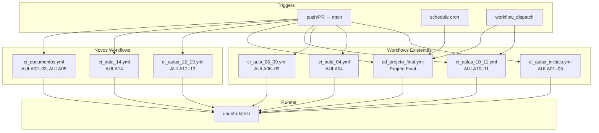
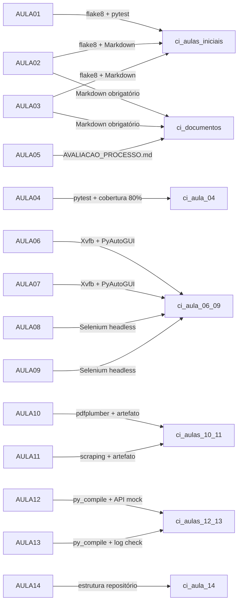

# Design Document: CI/CD Pipeline para RPA Labs (UNIFAAT)

## Overview

Este documento descreve o design técnico dos pipelines de CI/CD do projeto de ensino de RPA da UNIFAAT. O repositório contém 14 laboratórios práticos (AULA01–AULA14) organizados em grupos temáticos, cada um com requisitos de validação distintos. O objetivo é que cada grupo de labs possua um workflow GitHub Actions adequado ao seu perfil técnico, transformando o repositório em um modelo de boas práticas de engenharia de software para os alunos.

A solução consiste em **5 workflows existentes** (com melhorias pontuais) e **3 novos workflows** a criar, totalizando 8 arquivos YAML na pasta `.github/workflows/`.

---

## Architecture

### Visão Geral do Sistema



### Grupos de Labs e Workflows

| Workflow | Labs Cobertos | Perfil Técnico |
|---|---|---|
| `ci_aulas_iniciais.yml` | AULA01–03 | Linting (flake8) + pytest + Matrix Python |
| `ci_documentos.yml` *(novo)* | AULA02, AULA03, AULA05 | Validação de Markdown |
| `ci_aula_04.yml` | AULA04 | Matrix pytest + cobertura ≥ 80% |
| `ci_aula_06_09.yml` | AULA06–09 | Xvfb + Selenium headless |
| `ci_aulas_10_11.yml` | AULA10–11 | Extração de dados + artefatos |
| `ci_aulas_12_13.yml` *(novo)* | AULA12–13 | APIs REST + SMTP mock + logging |
| `ci_aula_14.yml` *(novo)* | AULA14 | Validação de estrutura de repositório |
| `cd_projeto_final.yml` | Projeto Final | CD com secrets + agendamento cron |

---

## Components and Interfaces

### 1. `ci_aulas_iniciais.yml` (existente — melhorias)

**Responsabilidade:** Validar qualidade de código dos labs de fundamentos Python (AULA01–03).

**Melhorias necessárias:**
- Adicionar `fail-fast: false` na estratégia Matrix (atualmente ausente).
- Adicionar exclusão de `.venv/` nos comandos flake8 (`--exclude=.venv`).
- Ajustar detecção de testes para ser mais robusta.

**Interface de entrada:** Push ou PR para `main`.

**Steps principais:**
1. `checkout@v4`
2. `setup-python@v5` com Matrix `["3.10", "3.11"]`
3. `cache@v4` com chave `${{ runner.os }}-pip-${{ matrix.python-version }}-${{ hashFiles('requirements.txt') }}`
4. Instalar dependências (condicional em `requirements.txt`)
5. `flake8` erros críticos: `--select=E9,F63,F7,F82 --exclude=.venv`
6. `flake8` PEP8: `--max-complexity=10 --max-line-length=127 --exclude=.venv`
7. Detectar arquivos de teste (`has_tests` output)
8. `pytest -q` (condicional em `has_tests == 'true'`)

---

### 2. `ci_documentos.yml` (novo)

**Responsabilidade:** Validar presença e qualidade dos arquivos Markdown obrigatórios nos labs sem scripts Python (AULA02, AULA03, AULA05).

**Interface de entrada:** Push ou PR para `main`.

**Steps principais:**
1. `checkout@v4`
2. Verificar `lab-02.md` e `lab-02_resp.md` — não-vazios, contêm `#`
3. Verificar `lab-03.md` e `lab-03_resp.md` — não-vazios, contêm `#`
4. Verificar `AULA05/AVALIACAO_PROCESSO.md` — presença e conteúdo mínimo
5. Exibir resumo consolidado de validações

**Decisão de design:** Usar shell script puro (`bash`) sem dependências Python para manter o workflow leve e rápido. A validação de "contém título Markdown" é feita com `grep -c '^#'`.

---

### 3. `ci_aula_04.yml` (existente — melhorias)

**Responsabilidade:** Testes unitários com cobertura mínima de 80% em Python 3.10 e 3.11.

**Melhorias necessárias:**
- Adicionar `fail-fast: false` na estratégia Matrix.
- Adicionar flag `--cov-fail-under=80` no comando pytest.
- Adicionar `cache@v4` para pip.

**Steps principais:**
1. `checkout@v4`
2. `setup-python@v5` com Matrix `["3.10", "3.11"]`
3. `cache@v4`
4. Instalar `pytest`, `pytest-cov` + `requirements.txt`
5. `pytest --cov=. --cov-report=term-missing --cov-fail-under=80 --ignore=.venv`

---

### 4. `ci_aula_06_09.yml` (existente — sem alterações estruturais)

**Responsabilidade:** Executar bots desktop (PyAutoGUI) e web (Selenium) em display virtual Xvfb.

**Sem alterações.** O workflow já atende os requisitos 3 e 4. Apenas confirmação de que usa as versões corretas das actions.

---

### 5. `ci_aulas_10_11.yml` (renomear `pipeline_aulas_10_11.yml` + melhorias)

**Responsabilidade:** Executar scripts de extração de dados e publicar artefatos.

**Ação necessária:** Renomear arquivo para `ci_aulas_10_11.yml`.

**Melhorias:**
- Adicionar step para executar `scraper_noticias.py` com `|| true`.
- Adicionar step para publicar `noticias.csv` como artefato `relatorio-noticias-csv`.

**Steps principais:**
1. `checkout@v4`
2. `setup-python@v5` com Python 3.10
3. Instalar `pandas`, `openpyxl`, `pdfplumber`, `requests`, `beautifulsoup4`
4. `python leitor_faturas_pdf.py || true`
5. `upload-artifact@v4` para `relatorio_faturas.xlsx` (7 dias, `if-no-files-found: ignore`)
6. `python scraper_noticias.py || true`
7. `upload-artifact@v4` para `noticias.csv` (7 dias, `if-no-files-found: ignore`)

---

### 6. `ci_aulas_12_13.yml` (novo)

**Responsabilidade:** Validar sintaxe Python e execução controlada dos bots de integração com APIs e processamento assíncrono.

**Interface de entrada:** Push ou PR para `main`.

**Steps principais:**
1. `checkout@v4`
2. `setup-python@v5` com Python 3.10
3. Instalar `requests`, `tenacity` + `requirements.txt`
4. Verificar sintaxe: `python -m py_compile AULA12/bot_cotacao_alerta.py`
5. Verificar sintaxe: `python -m py_compile AULA13/bot_faturamento_avancado.py`
6. Executar `AULA12/bot_cotacao_alerta.py` com `MOCK_EMAIL=true` (`|| true`)
7. Executar `AULA13/bot_faturamento_avancado.py` (`|| true`)
8. Verificar criação de `app_rpa.log` com ao menos uma linha

**Decisão de design:** Separar a verificação de sintaxe (`py_compile`) da execução (`python script.py`). Sintaxe deve falhar o job imediatamente; erros de runtime são tolerados com `|| true` por dependerem de rede ou credenciais.

---

### 7. `ci_aula_14.yml` (novo)

**Responsabilidade:** Validar estrutura de repositório e boas práticas (AULA14).

**Interface de entrada:** Push ou PR para `main`.

**Steps principais:**
1. `checkout@v4`
2. Verificar presença de `requirements.txt`, `.gitignore`, `README.md` (com AVISO para ausentes)
3. Validar conteúdo do `.gitignore`: linhas `.venv/` e `*.log`
4. Exibir resumo consolidado (presentes vs ausentes)
5. `exit 0` para garantir caráter pedagógico

**Decisão de design:** Todo o step de validação usa `bash` com `exit 0` explícito ao final. Avisos são informativos, não bloqueantes.

---

### 8. `cd_projeto_final.yml` (existente — sem alterações)

**Responsabilidade:** CD do bot de produção com secrets e agendamento cron.

**Sem alterações.** Já atende completamente o Requisito 8.

---

## Data Models

### Estrutura de Arquivos do Repositório

```
.github/
  workflows/
    ci_aulas_iniciais.yml     # AULA01–03 (existente, melhorado)
    ci_documentos.yml         # AULA02–03, AULA05 (novo)
    ci_aula_04.yml            # AULA04 (existente, melhorado)
    ci_aula_06_09.yml         # AULA06–09 (existente, sem mudança)
    ci_aulas_10_11.yml        # AULA10–11 (renomeado + melhorado)
    ci_aulas_12_13.yml        # AULA12–13 (novo)
    ci_aula_14.yml            # AULA14 (novo)
    cd_projeto_final.yml      # Projeto Final (existente, sem mudança)
```

### Mapeamento Lab → Workflow → Steps de Validação



### Modelo de Artefatos Gerados

| Artefato | Nome no GitHub Actions | Retenção | Workflow |
|---|---|---|---|
| `relatorio_faturas.xlsx` | `relatorio-faturas-excel` | 7 dias | `ci_aulas_10_11.yml` |
| `noticias.csv` | `relatorio-noticias-csv` | 7 dias | `ci_aulas_10_11.yml` |

### Modelo de Secrets (Projeto Final)

| Secret GitHub | Variável de Ambiente | Uso |
|---|---|---|
| `SMTP_EMAIL_USER` | `EMAIL_REMETENTE` | Autenticação SMTP |
| `SMTP_EMAIL_PASS` | `SENHA_APLICACAO` | Senha SMTP |
| `URL_SISTEMA_PROD` | `URL_SISTEMA_LEGADO` | URL do sistema legado |

---

## Correctness Properties

*Uma propriedade é uma característica ou comportamento que deve ser verdadeiro em todas as execuções válidas de um sistema — essencialmente, uma declaração formal sobre o que o sistema deve fazer. Propriedades servem como ponte entre especificações legíveis por humanos e garantias de corretude verificáveis por máquina.*

> **Nota sobre PBT neste contexto:** Os workflows YAML são arquivos de configuração declarativa (análogos a IaC). A maioria dos critérios de aceitação é do tipo SMOKE (configuração determinística). As propriedades abaixo representam as regras universais verificáveis sobre o *conjunto* de workflows — ou seja, para *qualquer* workflow no repositório, certas invariantes devem ser mantidas. Estas podem ser testadas como propriedades estruturais sobre os arquivos YAML usando um parser YAML em Python com `hypothesis`.

### Property 1: Padronização de actions em todos os workflows

*Para qualquer* arquivo YAML na pasta `.github/workflows/`, o step de checkout SHALL usar `actions/checkout@v4` e o step de configuração Python SHALL usar `actions/setup-python@v5`.

**Validates: Requirements 9.1, 9.2**

---

### Property 2: Cache de pip obrigatório em workflows com Matrix

*Para qualquer* workflow que contenha uma estratégia `strategy.matrix.python-version`, esse workflow SHALL conter um step com `actions/cache@v4` cuja chave (key) inclua `runner.os`, `matrix.python-version` e `hashFiles('requirements.txt')`.

**Validates: Requirements 9.3**

---

### Property 3: Retenção válida em artefatos publicados

*Para qualquer* step `actions/upload-artifact@v4` em qualquer workflow, o parâmetro `retention-days` SHALL ser um valor inteiro entre 1 e 30 (inclusive).

**Validates: Requirements 9.4**

---

### Property 4: Cobertura completa dos 14 labs

*Para qualquer* lab de AULA01 a AULA14, deve existir ao menos um step de validação (linting, pytest, Markdown check, estrutura ou execução) mapeado a esse lab em algum dos workflows do repositório.

**Validates: Requirements 10.1, 10.2, 10.3, 10.4, 10.5**

---

### Property 5: Validação de Markdown não-vazio com título

*Para qualquer* arquivo `lab-XX.md` ou `lab-XX_resp.md` submetido ao repositório, o step de validação Markdown SHALL reportar `VÁLIDO` se e somente se o arquivo é não-vazio E contém ao menos uma linha iniciada com `#`; caso contrário, SHALL reportar `AVISO`.

**Validates: Requirements 10.6**

---

### Property 6: Aviso de arquivo obrigatório é proporcional à ausência

*Para qualquer* combinação de presença/ausência dos arquivos `requirements.txt`, `.gitignore` e `README.md` na raiz do repositório, o workflow `ci_aula_14.yml` SHALL emitir a palavra `AVISO` no log exatamente para os arquivos ausentes e não emitir `AVISO` para os presentes.

**Validates: Requirements 7.2, 7.3, 7.4**

---

### Property 7: Detecção de testes é coerente com a estrutura do repositório

*Para qualquer* estrutura de repositório (com ou sem arquivos `test_*.py` ou `tests/**/*.py`), o output `has_tests` do step de detecção SHALL ser `true` se e somente se ao menos um arquivo de teste existe no repositório.

**Validates: Requirements 1.6, 1.7**

---

## Error Handling

### Estratégia Geral de Tolerância a Falhas

Os workflows seguem dois paradigmas dependendo da natureza do step:

**Falha bloqueante (job falha imediatamente):**
- Erros críticos de sintaxe Python detectados por `flake8` (flags E9, F63, F7, F82)
- Cobertura de testes abaixo de 80% (flag `--cov-fail-under=80`)
- Erros de sintaxe detectados por `python -m py_compile`

**Falha tolerada (step completa com exit code 0):**
- Execução de scripts de automação web/desktop em CI (`|| true`)
- Execução de scripts de extração de dados (`|| true`)
- Execução de bots com dependências externas (APIs, rede) (`|| true`)
- Ausência de arquivos obrigatórios nos labs de fundamentos (`exit 0` explícito)

### Tabela de Cenários de Erro por Workflow

| Workflow | Cenário de Erro | Comportamento |
|---|---|---|
| `ci_aulas_iniciais.yml` | `requirements.txt` ausente | Pula instalação, continua |
| `ci_aulas_iniciais.yml` | Nenhum arquivo de teste | Pula pytest, continua |
| `ci_aulas_iniciais.yml` | Erro crítico de sintaxe | **Falha imediata** |
| `ci_aula_04.yml` | Cobertura < 80% | **Falha imediata** |
| `ci_aula_06_09.yml` | Bot falha em display virtual | Registra erro, exit 0 |
| `ci_aulas_10_11.yml` | Script de extração falha | Registra erro, exit 0, publica artefato vazio |
| `ci_aulas_12_13.yml` | Erro de sintaxe em script | **Falha imediata** |
| `ci_aulas_12_13.yml` | Falha de chamada de API | Registra erro, exit 0 |
| `ci_aulas_12_13.yml` | `app_rpa.log` não criado | **Falha** (evidência de não-execução) |
| `ci_aula_14.yml` | Arquivo obrigatório ausente | Registra AVISO, exit 0 (pedagógico) |
| `cd_projeto_final.yml` | `main.py` não encontrado | Exibe mensagem informativa, continua |

### Tratamento de Secrets Ausentes

No workflow `cd_projeto_final.yml`, se os secrets `SMTP_EMAIL_USER`, `SMTP_EMAIL_PASS` ou `URL_SISTEMA_PROD` não estiverem configurados no repositório, as variáveis de ambiente serão vazias (`""`). O bot deve tratar esse cenário internamente (fora do escopo do pipeline).

---

## Testing Strategy

### Abordagem Dual

Esta feature é essencialmente configuração de infraestrutura (arquivos YAML). A estratégia de testes combina:

1. **Testes unitários de estrutura YAML** — Verificar configurações específicas em arquivos concretos
2. **Testes de propriedade estrutural** — Verificar invariantes sobre o conjunto completo de workflows usando `hypothesis`

### Ferramentas

- **Linguagem de teste:** Python 3.10+
- **Framework de testes:** `pytest`
- **Biblioteca de PBT:** `hypothesis` (para as propriedades estruturais)
- **Parser YAML:** `PyYAML` (`pyyaml`)

### Testes Unitários (Exemplos Concretos)

```
tests/
  test_ci_aulas_iniciais.py      # Testa estrutura do YAML de iniciais
  test_ci_aula_04.py             # Testa matrix, fail-fast, --cov-fail-under
  test_ci_aulas_10_11.py         # Testa triggers e artefatos
  test_ci_aulas_12_13.py         # Testa instalação, MOCK_EMAIL, py_compile
  test_ci_aula_14.py             # Testa steps de validação de repositório
  test_cd_projeto_final.py       # Testa triggers, cron, secrets
  test_workflow_standards.py     # Testa padronização (Property 1-4)
  test_markdown_validator.py     # Testa lógica de validação Markdown (Property 5)
  test_file_presence_checker.py  # Testa lógica de aviso de arquivos (Property 6)
```

**Exemplos de testes unitários:**

- Verificar que `ci_aula_04.yml` contém `fail-fast: false`
- Verificar que `ci_aula_04.yml` contém `--cov-fail-under=80` no comando pytest
- Verificar que `cd_projeto_final.yml` contém trigger `schedule` com cron `0 0 * * *`
- Verificar que `ci_aulas_12_13.yml` define `MOCK_EMAIL: true` como variável de ambiente
- Verificar que `pipeline_aulas_10_11.yml` foi renomeado para `ci_aulas_10_11.yml`

### Testes de Propriedade (Property-Based Tests)

Cada propriedade usa `hypothesis` com mínimo de 100 iterações:

**Property 1 — Padronização de actions:**
```python
# Feature: cicd-pipeline-rpa-labs, Property 1: Padronização de actions em todos os workflows
@given(st.sampled_from(get_all_workflow_files()))
@settings(max_examples=100)
def test_all_workflows_use_standard_actions(workflow_path):
    # Verifica checkout@v4 e setup-python@v5 em todos os workflows
```

**Property 2 — Cache obrigatório em workflows com Matrix:**
```python
# Feature: cicd-pipeline-rpa-labs, Property 2: Cache de pip obrigatório em workflows com Matrix
@given(st.sampled_from(get_matrix_workflows()))
@settings(max_examples=100)
def test_matrix_workflows_have_cache(workflow_path):
    # Verifica presença de cache@v4 com chave estruturada corretamente
```

**Property 3 — Retenção válida em artefatos:**
```python
# Feature: cicd-pipeline-rpa-labs, Property 3: Retenção válida em artefatos publicados
@given(st.sampled_from(get_upload_artifact_steps()))
@settings(max_examples=100)
def test_artifact_retention_in_valid_range(step):
    # Verifica 1 <= retention_days <= 30
```

**Property 5 — Validação de Markdown:**
```python
# Feature: cicd-pipeline-rpa-labs, Property 5: Validação Markdown não-vazio com título
@given(st.text())
@settings(max_examples=100)
def test_markdown_validation_logic(content):
    # Verifica que is_valid_markdown(content) == (len(content) > 0 and any linha com #)
```

**Property 6 — Aviso de arquivo obrigatório:**
```python
# Feature: cicd-pipeline-rpa-labs, Property 6: Aviso proporcional à ausência
@given(
    st.booleans(),  # requirements.txt presente?
    st.booleans(),  # .gitignore presente?
    st.booleans()   # README.md presente?
)
@settings(max_examples=100)
def test_warning_proportional_to_absence(has_requirements, has_gitignore, has_readme):
    # Verifica que check_required_files() emite AVISO exatamente para os ausentes
```

**Property 7 — Detecção de testes coerente:**
```python
# Feature: cicd-pipeline-rpa-labs, Property 7: Detecção de testes coerente com estrutura
@given(st.lists(st.text(alphabet=st.characters()), min_size=0, max_size=20))
@settings(max_examples=100)
def test_test_detection_coherence(file_names):
    # Verifica que detect_tests(file_names) == any(f.startswith('test_') for f in file_names)
```

### Configuração de Cobertura

Todos os testes de propriedade devem ser executados com mínimo de **100 iterações** (padrão do `hypothesis`). A cobertura do código de validação (funções Python puras extraídas dos scripts bash) deve ser ≥ 80%.

### Integração Contínua dos Próprios Testes

Os testes da feature `cicd-pipeline-rpa-labs` podem ser executados localmente:

```bash
cd .kiro/specs/cicd-pipeline-rpa-labs/
pip install pytest hypothesis pyyaml
pytest tests/ -q
```
